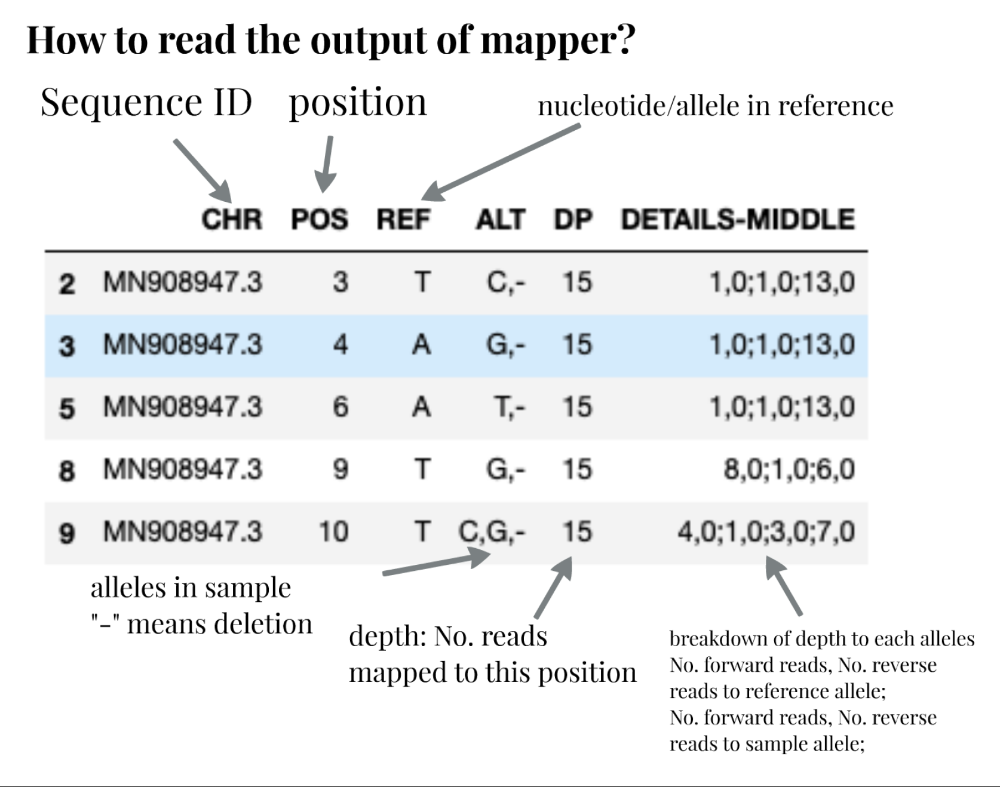
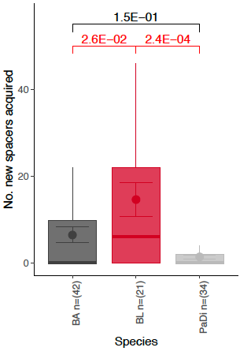
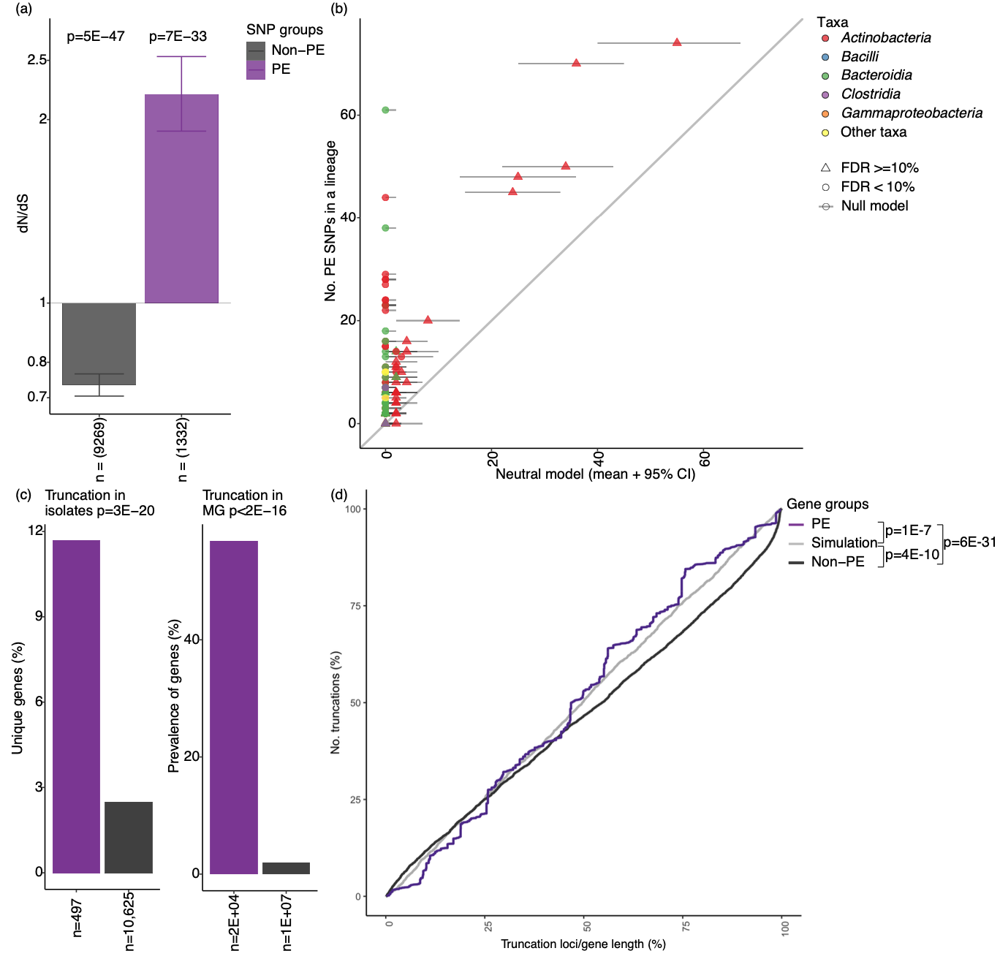
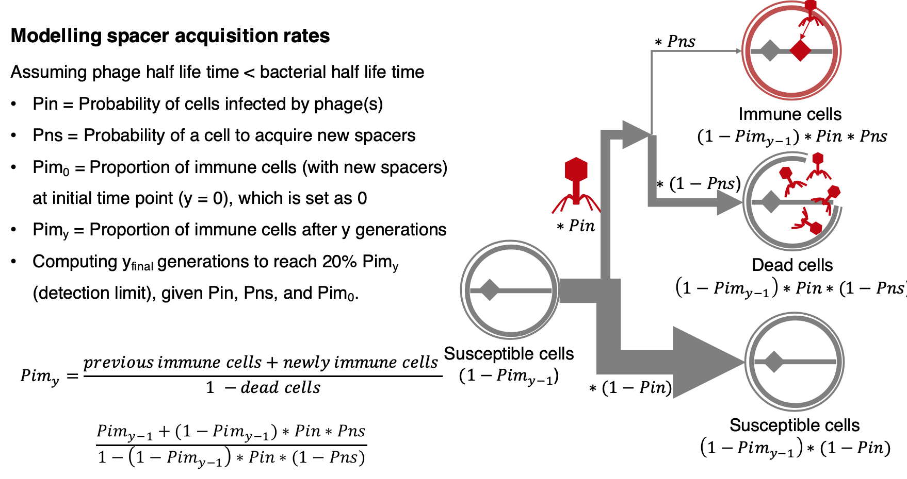
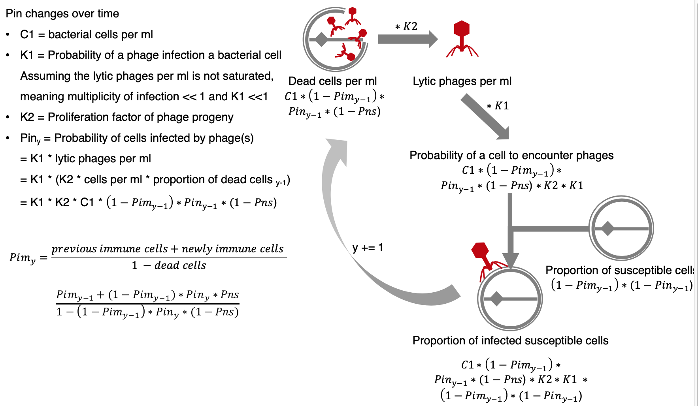

# Bioinformatics
The application of tools of computation and analysis to the capture and interpretation of biological data
1) To know what tools to use and how to use the tools
2) How to interpret data and test our hypotheses: statistic tests, null model, and visualization

#### [Examples can be downloaded here](https://drive.google.com/drive/folders/1kKDsmsKNie8CC5E5nbRnrGmh30A7a5hf?usp=sharing)

## Tools
* [anaconda or miniconda](https://docs.conda.io/en/latest/miniconda.html): get python 3.9 version\
Many tools + their required environments can be easily installed by conda!\
Can you find how to install blast by conda? Hint: search `conda install blast` on Google.\
Homework 1: install conda and [install blast by conda](https://anaconda.org/bioconda/blast).
* [pip](https://anaconda.org/anaconda/pip)\
Many python packages can be easily installed pip!\
Homework 2: install pip and use pip to install pandas (`pip install pandas`)
* sequence similarity search: of course, to find sequences in your data that are similar to what have been annotated by other people\
    * Blast+: benchmark, slow but accurate
        * `makeblastdb -in your_database -dbtype nucl`: make db for DNA
        * `makeblastdb -in your_database -dbtype prot`: make db for protein
    * [Diamond](https://anaconda.org/bioconda/diamond): fast, protein database only
        * `diamond makedb --in your_database -d your_database.dmnd`
        * `diamond blastp --query your_sample.faa --db your_database.dmnd --out your_result.txt --id 50 --query-cover 80 --outfmt 6 --max-target-seqs 2 --evalue 1e-1 --threads 10`
    * [Usearch](https://www.drive5.com/usearch/download.html): fast, nucleotide database only?
        * `usearch -makeudb_usearch your_database -output your_database.udb`
    * [hmm](https://anaconda.org/bioconda/hmmer): domain based
        * `hmmsearch --tblout your_result.txt --cpu 10 -E 0.01 your_database.hmm your_sample.faa`
Homework 3.1 in folder example/HGT: find HGT regions among 2 genomes by similarity >= 100% over 1kbp genomic region
* sequence mapping/alignment: bioinformaticians just enjoy making up words\
To align reads, usually metagenomes, to a known reference genome
    * abundance of a known species in a sample
    * SNPs, indels of a known species in a sample -> infer strains, genes under positive selection\
**Tools**
    * [Mapper](https://github.com/mathjeff/Mapper): fast, accurate, short read only, easy to use.
    * [bowtie2](http://bowtie-bio.sourceforge.net/bowtie2/manual.shtml): slow, short read only, designed for human genomes, requires other tools such as samtools and bcftools for downstream analysis.
    * [minimap2](https://github.com/lh3/minimap2): slightly faster than bowtie2, long read too, designed for human genomes, requires other tools such as samtools and bcftools for downstream analysis.\
**Homework 3.2** in folder example/EsCoTrack: use mapper to track E.coli strains in a metagenome
**Homework 3.3** in folder example/CovidVariant: use mapper to identify SARS-COV-2 mutations in a metagenome\
**Note**: for windows PC, you might need to replace '/' in directory path to '\\'!\

* assembly: assemble short reads into long reads 
    * for WGS (whole genome sequencing): SPAdes
    * for metagenomes: metaSPAdes, IDBA-UD, MEGAHIT
    * for long reads: metaFlye, Raven, Canu (challenges: high indel errors)\
**binning: long reads -> draft genome**
    * MetaBAT2, CONCOCT, MaxBin, DasTOOL\
**dereplicate genomes**:
    * dRep (all genomes from all environments at 97-99% identity)
**annotate taxonomy**
    * gtdb classify_wf: also for WGS\
**check contamination**
    * checkM
* Metagenome analysis
    * taxonomy annotation
        * kraken
        * strainphylan
        * metaphylan
    * gene annotation
        * [Eggnog (COG)](http://eggnog5.embl.de/): hmm, free
        * KEGG: not free [BlastKOALA](https://www.kegg.jp/blastkoala/) blast, online only; [KofamKOALA](https://www.genome.jp/tools/kofamkoala/): hmm, online and local
        * [CAZY](http://www.cazy.org/): Carbohydrate-Active enZYmes Database, online and local
        * ARG: [arg_ranker](https://github.com/caozhichongchong/arg_ranker/tree/v2.0/arg_ranker): risk analysis, local; [CARD](https://card.mcmaster.ca/): online and local; [args_oap](https://smile.hku.hk/SARGs): online only;
        * Database of your interest
    * strain identification
        * InStrain, strainGE, strainfinder
    * MGE identification
        * [SRID](https://github.com/XiaofangJ/SRID)
        * [MGEfinder](https://github.com/bhattlab/MGEfinder)
    * Homework 3.4: annotate ARGs in a metagenome sample (example/EsCoTrack/data/Human_gut_microbiome.fastq) `pip install arg_ranker`
* genome analysis
    * taxonomy annotation
        * 16S: blast to 16S database, such as [greengenes](https://greengenes.secondgenome.com/),
        * gtdb classify_wf
    * gene annotation
        * prokka
        * same databases for metagenome analysis, different cutoff, why?
    * MGE identification
        * [Identify integrative and conjugative elements on genomes](https://db-mml.sjtu.edu.cn/ICEfinder/instruction.html)
        * [Differentiate chromosomes from plasmids](https://cge.cbs.dtu.dk/services/PlasmidFinder/)
        * [Identify integrons on genomes](https://github.com/caozhichongchong/I-VIP)
        * [MGEfinder](https://github.com/bhattlab/MGEfinder): requires fastq
    * SNPs and indels identification 
        * mapper
        * DeepVariant: bam files (output of bowtie2, minimap2, ...) as input
    * genome - genome comparison
        * fastANI: pairwise comparison
        * pangenome analysis: core, flexible, unique genes
            * [roary](https://sanger-pathogens.github.io/Roary/)
        * multiple sequence analysis
            * mafft, muscle
* 16S analysis
    * Qiime2 (install + execute code in scripts/qiime2.sh.txt)

## [Data analysis interpretation](https://xkcd.com/2582/)
1) Hypothesis -> null hypothesis -> to test against the [null hypothesis](https://xkcd.com/892/)
2) Data -> find interesting trend/pattern -> hypothesis -> null hypothesis -> ... 
* Null model
    * Hypothesis: target genes in my data are under positive selection\
    Should show a higher ratio of nonsynonymous mutations (N SNPs) than expected
    * Null model: the (high) ratio of nonsynonymous mutations in my target genes can be explained by random mutation
    * How to build the null model?
        * 1,000-time simulation: easy to think, hard to do and requires computing power\
        Computing the No. SNPs observed in my data (X)\
        Computing the mutational frequency observed in my data: e.g. 20% A-T 30% G-C ...\
        Randomly generating X SNPs in Y length of target genes (following the mutational frequency)\
        Computing the No. N SNPs in the simulation\
        Computing mean + 95% confidence interval of the No. N SNPs in all simulation\
        Expected value get!
        * Math: hard to think but easy to do, and super fun\
        For each codon, computing the probability of N SNPs for a giving mutational type (e.g. A-T) -> P(N_A-T)\
        For a gene, combining P(N_A-T) of all codons\
        Computing expected No. N SNPs (A-T) giving No. A-T SNPs\
        Computing expected No. N SNPs (A-T) giving No. SNPs of all mutational types\
        Using binom test to compute the probability to obtain the observed data if the null hypothesis is true\
        If p < 0.05 -> reject null model\
        If p > 0.05 -> retain null model.
* [Statistic tests](https://xkcd.com/882/)
    * To compute the probability to obtain the observed data if the null hypothesis is true\
    If [p < 0.05](https://xkcd.com/1478/) -> reject null model\
    If p > 0.05 -> retain null model.\
    Sometimes people use 0.01, for example, to narrow down the targets
    * multiple hypothesis testing (false discovery rate)\
    Does microbe 1 correlate with host age?\
    Does microbe 2 correlate with host age?\
    Does microbe 3 correlate with host age?\
    Does microbe 4 correlate with host age?\
    ...\
    Does microbe 100 correlate with host age?\
    If 100 tests are each conducted at the 5% significant level and all corresponding null hypotheses are true,\
    the expected number of incorrect rejections (also known as false positives) is 5.\
    -> FDR adjusting [in python](https://www.statsmodels.org/devel/stats.html#multiple-tests-and-multiple-comparison-procedures)
    * Examples
        * Hypothesis: B.longum acquires spacers faster than other species\
        Null hypothesis: All species have similar rate of acquiring CRISPR spacers -> \
        No. newly acquired spacers ()over one year) in different species have no significant difference.\
        two-way anova test [in python](https://www.statsmodels.org/dev/generated/statsmodels.stats.anova.anova_lm.html)\
        
        * Hypothesis: target genes (PE, parallel evolution) are likely targets of adaptive evolution in gut commensal species. 
        
        Figure a: dN/dS of target genes is significantly higher than expected (a one-sided [binomial test](https://docs.scipy.org/doc/scipy/reference/generated/scipy.stats.binom_test.html) compared to an expectation of 1)\
        Figure b: Observed PE SNPs are significantly higher than expected PE SNPs (CI 95%) based on 100 replicate simulations.\
        Figure c: Truncations were significantly enriched on PE genes versus non-PE genes ([fisher exact test](https://docs.scipy.org/doc/scipy/reference/generated/scipy.stats.fisher_exact.html)). \
        Figure d: Truncation loci on PE genes were found significantly smaller (closer to the start codon than non-PE genes (a one-sided [ks-test](https://docs.scipy.org/doc/scipy/reference/generated/scipy.stats.kstest.html)).         
* Visualization
    * I love seaborn and matplotlib (only the one in python, not in MATLAB)\
    `pip install seaborn` # for plotting\
    `pip install matplotlib` # for plotting\
    `pip install pandas` # for processing data (data frame)\
    `pip install numpy` # for math on array\
    `pip install scipy` # for statistics
    * Useful links of plotting examples\
    [Regression data](https://seaborn.pydata.org/tutorial/regression.html)\
    [Statistical relationships](https://seaborn.pydata.org/tutorial/relational.html)\
    [Distribution of data](https://seaborn.pydata.org/tutorial/distributions.html)\
    [Categorical data](https://seaborn.pydata.org/tutorial/categorical.html)
    * A quick work through [Example can be downloaded here](https://drive.google.com/drive/folders/1kKDsmsKNie8CC5E5nbRnrGmh30A7a5hf?usp=sharing)

* [Model](https://xkcd.com/2169/)
    * predictive model and cross validation
        * To predict the number of genes under positive selection by:\
        Genetic information (No. SNPs, total No. genes, average gene length)\
        Taxonomy information (species, gram positive/negative)\
        Ecology information (abundance and prevalence of a species)\
        Host information (diet, age, BMI, ...)\
        -> training a random forest model based on a subset of data (for example, shuffle each species out of the subset)\
        -> using the model to predict another subset of data\
        -> computing the accuracy\
        -> evaluating the importance of different parameters (out of the bag in turns, computing accuracy decrease)
    * descriptive model
        * Based on knowledge and logic
        * How does crispr spacer array evolve?
        
        

## Contact
anniz44@mit.edu or caozhichongchong@gmail.com
